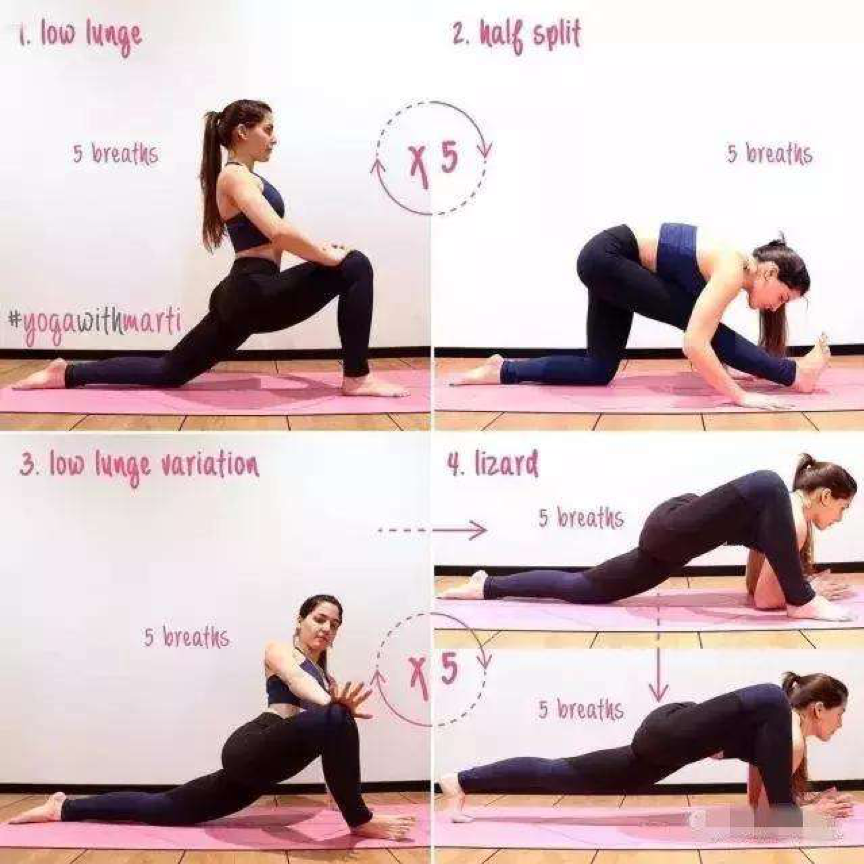
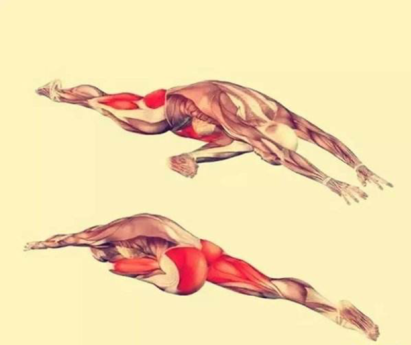
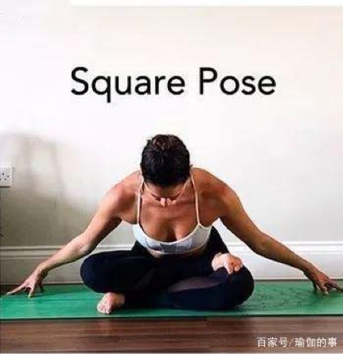
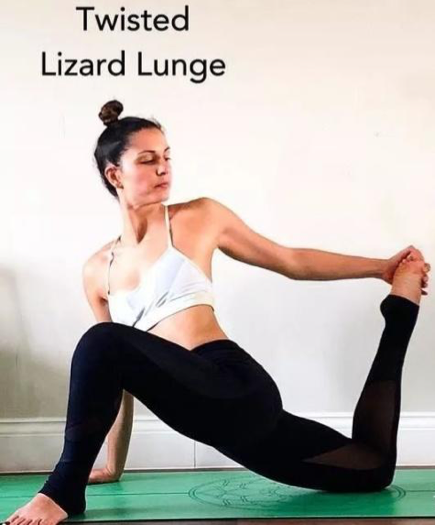
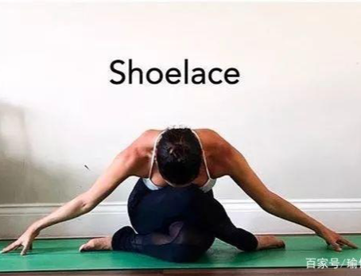

# 全方位开髋
一个灵活的髋部，可以改善瑜伽体式的练习效果，有效的改善双腿血液循环，缓解背部疼痛，排毒养颜的效果更是惊人，所以，开髋很重要。也是双莲花的基础。

## 下犬+蜥蜴式

从下犬式开始，迈左脚向前左腿大小腿90°，双手放在左脚内侧后方脚背膝盖贴地保持1分钟，换边

## 下犬+睡鸽式

从下犬式开始左腿向前迈开，在前方着地脚回勾，右腿膝盖脚背贴地躯干向前，双手往前延展保持1分钟，换边

## 蹲坐式
山式，双脚分开略比肩宽，脚尖外展双手于胸前合十，慢慢屈膝下蹲大臂外侧与大腿内侧互抵保持1分钟。

## 趴青蛙式
跪立在垫面上，小腿脚背贴地毛毯放在旁侧，分开双膝双膝向两侧滑动打开脚踝、膝盖都是90°保持1分钟

## 方块式
 

坐立，吸气延展脊柱左小腿放在右小腿上方脚踝和膝盖分别对齐，脚回勾呼气躯干向前向下保持8个呼吸，换边。

## 扭转+蜥蜴式

从蜥蜴式开始，屈右膝右小腿找臀部，向左扭转身体左手向后抓住右脚尖保持8个呼吸，换边。

## 牛面式变体

从手杖式开始，屈双膝，双腿交叉脚背贴地，双膝膝盖重叠超前双臂在旁侧延展，指尖触地保持8个呼吸，换边

## 束角式
坐立，屈双膝，脚掌心相对膝盖往下沉，双手抓住脚踝保持1分钟

